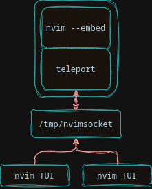

# teleport.nvim 🌀

**Edit independently in a shared neovim instance**

Use cases:
- Open different buffers in the same instance from multiple tmux windows/panes
- reduce duplicate LSP servers when opening multiple files in the same project
- reduce load by running one instance per project

## What about `nvim --server <addr> --remote-ui`?
Current state of nvim only allows mirroring the same view of an instance, so
you can't have 2 different buffers opened in different windows. For example,
switching buffers in one window switches the buffer in all attached UIs.

## Usage

```
go install github.com/Niceadam/teleport.nvim
alias tvim=teleport

tvim {my_project} (terminal 1: starts new instance and connects to it)
tvim {my_project} (terminal 2: connects to existing instance)
...
```

## How does it work?

teleport runs a proxy server between the nvim TUI and an embedded nvim
instance. The proxy handles connections to individual attached UIs and relays
events to the right clients

<p align="center">
  
</p>

